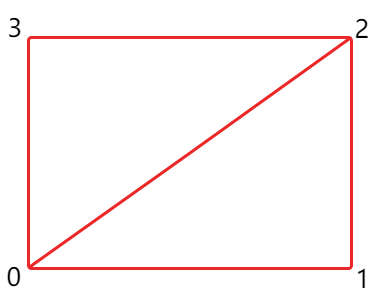
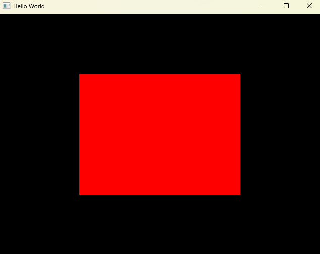

## 开始之前
前面我们说过顶点缓冲（vertex buffer）中不仅仅包含顶点数据，还可能包含法向量颜色、法线、切线等等数据。当我们绘制简单的三角形时，我们可以选择直接使用vertex buffer进行绘制，这要求我们将三角形的每一个顶点数据上传上GPU。

<div align=center>


</div>

当我们考虑绘制比三角形更复杂的图形，例如矩形（由两个三角形构成，GPU更擅长绘制三角形），如果按照直接使用vertex buffer进行绘制，我们需要将两个三角形的6个顶点数据全部上传到GPU，而事实上绘制这个矩形我们只需要四个顶点，有两个顶点被重复拷贝到GPU造成了显存浪费。对于矩形这类简单的图形这种显存浪费可能并不显著，然而现实中的绘制复杂度远远大于矩形，尤其是当vertex buffer中的包含了如颜色等其他数据时，造成的显存浪费更加明显。</br>

这时，我们就需要使用index buffer，而index buffer正是实际使用的最多的绘制方式。简单来说，索引缓冲(index buffer)最大的特点就是不需要上传重复的vertex buffer数据到GPU，而是额外上传一份顶点的索引数据。例如上述矩形，我们仅需要上传4个顶点的数据到GPU，并且再上传一份用于绘制两个三角形所需要顶点的索引值[0, 1, 2, 2, 3, 0]，虽然需要额外的索引值，但索引值通常固定为unsinged int、unsigned short等，相比于包含多种数据的vertex buffer顶点而言可以节省大量内存。

## 使用index buffer绘制矩形
1. **定义矩形的四个顶点坐标及index索引值**
    ```cpp
    float positions[] = {
    	-0.5f, -0.5f,
    	 0.5f, -0.5f,
    	 0.5f,  0.5f,
    	-0.5f,  0.5f
    };

    unsigned int indices[] = {
		0, 1, 2,
		2, 3, 0
	};
    ```
2. **定义index buffer object**</br>
    和vertex buffer定义方式类似，只是目标绑定为**GL_ELEMENT_ARRAY_BUFFER**
    ```cpp
    unsigned int ibo;
	glGenBuffers(1, &ibo);
	glBindBuffer(GL_ELEMENT_ARRAY_BUFFER, ibo);
	glBufferData(GL_ELEMENT_ARRAY_BUFFER, 6 * sizeof(unsigned int), indices, GL_STATIC_DRAW);
    ```

3. **更换绘制命令**</br>
    索引缓冲定义后将和vertex buffer绑定，调用**glDrawElements**将绘制索引缓冲中的数据。
    ```cpp
    //glDrawArrays(GL_TRIANGLES, 0, 3);
	glDrawElements(GL_TRIANGLES, 6, GL_UNSIGNED_INT, 0);
    ```

## 绘制结果
<div align=center>


</div>

::github{repo="ljiaooo/LearnOpenGL"}

[Commit Link](https://github.com/Ljiaooo/LearnOpenGL/tree/8f5f431a7fb123861982f9ba8a332390456b9eca)