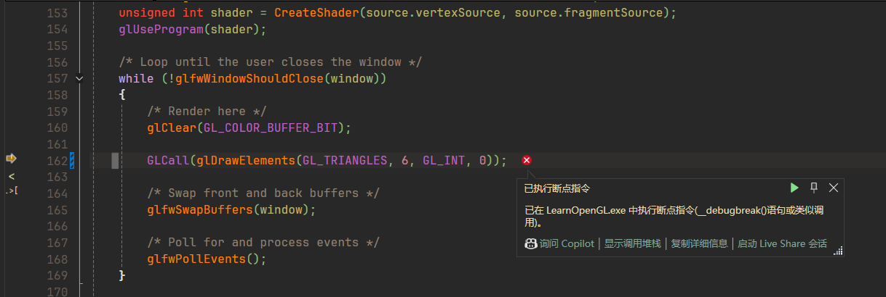
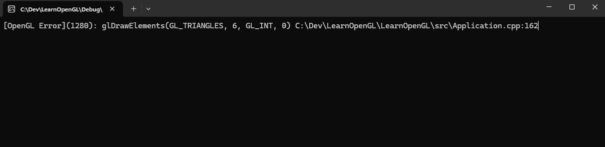
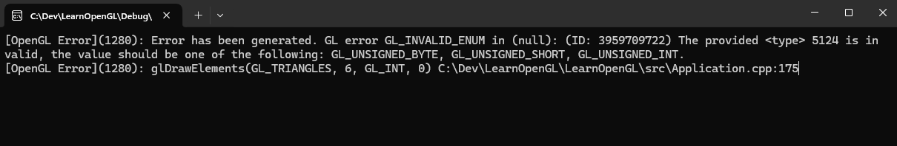

## 开始之前
OpenGL很多时候并不会主动告诉你程序哪里除了问题而只是展示一个没有任何绘制图形的黑色窗口，因此我们需要OpenGL提供的Debug工具来检查程序出现的问题。OpenGL提供了两种Debug方法，其中一种是使用**glGetError**接口，这是一种传统的调试方式，但好处是兼容更低版本的OpenGL(since 2.1)，另一种方式是使用**glDebugMessageCallback**，这是一种更现代的调试方式(since 4.3)，提供了更详细的调试信息和调试控制。我们将在接下来介绍这两种调试方式。

## glGetError
**glGetError**是OpenGL中的一个传统错误检测机制，用于查询 OpenGL 的状态机中是否有错误发生。</br>
1. **特点:** 
- 逐个错误查询，每次调用**glGetError**只能返回一个错误，如果有多个错误，需要多次调用。
- 只能返回错误码，没有额外调试信息。


2. **清空错误信息**</br>
在使用glGetError确定某条语句执行后是否发生错误时，我们需要在这条语句执行前清空错误信息。

    ```cpp
    static void GLClearError()
    {
    	while (glGetError() != GL_NO_ERROR);
    }
    ```
    由于**glGetError**每次调用仅会取出一条错误信息，因此清除语句执行前的所有其他错误信息需要重复调用**gGetError**直到返回**GL_NO_ERROR**，表示清除完所有错误信息。

3. **检查错误信息**</br>
在执行完某个OpenGL语句后，调用如下的错误检查函数来确定该语句是否发生错误

    ```cpp
    static bool GLCheckError(const char* function, const char* file, int line)
    {
	    while (GLenum error = glGetError())
	    {
		    std::cout << "[OpenGL Error](" << error << ")" << std::endl;
		    return true;
	    }
	    return false;
    }
    ```
    综合上述，使用**glGetError**来获取错误的示例如下，如果OpenGL代码出现错误，如**GL_UNSIGNED_INT**被错误的写成**GL_INT**，将会被捕获并打印。
    ```cpp
    GLClearError();
    //glDrawElements(GL_TRIANGLES, 6, GL_UNSIGNED_INT, 0); //示例语句
    glDrawElements(GL_TRIANGLES, 6, GL_UNSIGNED_INT, 0); //示例语句(GL_UNSIGNED_INT替换为GL_INT)
    GLCheckError();
    ```

4. **进一步优化**</br>
如果要检查每一条OpenGL语句我们需要将这些语句都用上面的代码包围，我们可以使用宏定义优化一下这个步骤。
    ```cpp
    #define GLCall(x) \
        GLClearError();\
        x;\
        GLCheckError()
    ```
    这样我们只需要使用GLCall包围需要执行的OpenGL语句，
    ```cpp
    GLCall(glDrawElements(GL_TRIANGLES, 6, GL_UNSIGNED_INT, 0));
    ```
    需要特别注意的是，在单条if语句中，上述宏会导致一些问题，例如
    ```cpp
    if (condition)
        GLCall(glDrawElements(GL_TRIANGLES, 6, GL_UNSIGNED_INT, 0));

    // 会被解释成，如下代码。事实上仅有GLClearError()被包含在if内
    if (condition)
        GLClearError();
        glDrawElements(GL_TRIANGLES, 6, GL_UNSIGNED_INT, 0);
        GLCheckError();
    ```
    我们还可以在出现错误的语句添加断点来快速定位错误语句，同时，我也可以将出现错误的位置打印出来，这些都可以利用宏定义实现。
    ```cpp
    #define ASSERT(x) if (x) __debugbreak()

    #define GLCall(x)\
    	GLClearError();\
    	x;\
    	ASSERT(GLCheckError(#x, __FILE__, __LINE__));

    static bool GLCheckError(const char* function, const char* file, int line)
    {
    	while (GLenum error = glGetError())
    	{
    		std::cout << "[OpenGL Error](" << error << "): "
    			<< function << " " << file << ":" << line;
    		return true;
    	}
    	return false;
    }
    ```
    **最终效果如下：[Commit Link](https://github.com/Ljiaooo/LearnOpenGL/tree/ae8730b5b19f3127fd2729431047769b2a3411fe)**
    <div align=center>

    
    ---
    
    </div>

## glDebugMessageCallback
**glDebugMessageCallback**提供了更加现代化的OpenGL Debug方式，我们只需要传递一个函数指针用于处理Debug信息即可。除了错误信息，其还会提供更加详细的Debug建议等，因此如果我们使用的是更现代的OpenGL版本，更推荐使用**glDebugMessageCallback**而不是**glGetError**来调试OpenGL。
1. **回调函数原型**</br>
从函数原型可以看出，**glDebugMessageCallback**提供了多种调试信息并且支持用户自定义数据。
    ```cpp
    typedef void (APIENTRY *DEBUGPROC)(GLenum source,
            GLenum type,
            GLuint id,
            GLenum severity,
            GLsizei length,
            const GLchar *message,
            const void *userParam);
    ```

2. **定义回调函数**</br>
下面仅对错误id和调试信息进行简单打印。
    ```cpp
    static void GLAPIENTRY GLDebugCallback(GLenum source, GLenum type, GLuint id, GLenum severity, GLsizei length, const GLchar * message, const void* userParam)
    {
    	std::cout << "[OpenGL Error](" << id << "): " << message << std::endl;
    }
    ```
3. **启用调试输出并注册回调函数**
    ```cpp
    // 启用调试输出
    glEnable(GL_DEBUG_OUTPUT);
    glDebugMessageCallback(GLDebugCallback, nullptr);
    ```
4. **调试输出结果：[Commit Link](https://github.com/Ljiaooo/LearnOpenGL/tree/ea5b3b3b369dc2f097a737877e04702e991ee1d7)**</br>
一旦定义好回调函数并注册后，OpenGL会在遇到错误时**自动**调用回调函数。

    <div align=center>

    
    </div>

::github{repo="ljiaooo/LearnOpenGL"}
